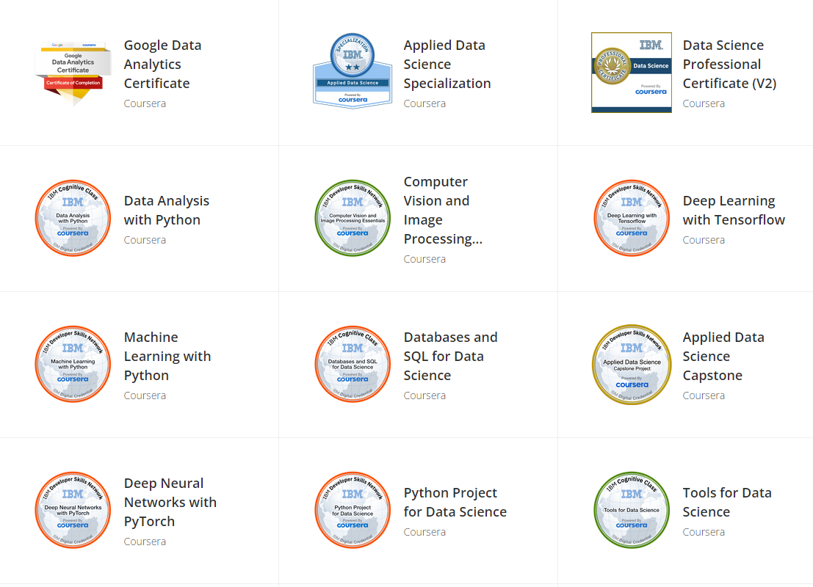

- 👋 你好Hello, I’m @ssocean, Penghai Zhao, 赵鹏海.
- 🌱 Currently learning Computer Vision and Pattern Recognition.
- 📫 oceanytech@gmail.com

<!--   my-icons -->

    
    
    
    
    
       

<!--   my-header-img -->

<!--   my-ticker -->    

<!--   my-kaggle     
### My achievements on [kaggle](https://www.kaggle.com/andrej0marinchenko):

-->

<!--   my-skils -->

| Property                                        | Data                                                                                                                                                                                                                                                                                                                                                                                                                                                                                                                                                                                                                                                                                                                                                                                                                                                                                                                                                                                                                                                                                                                                                                                                                                                                                                                                                                                                                                                                                                                                                                                                                                                                                                                                                                                                            |
|-------------------------------------------------|-----------------------------------------------------------------------------------------------------------------------------------------------------------------------------------------------------------------------------------------------------------------------------------------------------------------------------------------------------------------------------------------------------------------------------------------------------------------------------------------------------------------------------------------------------------------------------------------------------------------------------------------------------------------------------------------------------------------------------------------------------------------------------------------------------------------------------------------------------------------------------------------------------------------------------------------------------------------------------------------------------------------------------------------------------------------------------------------------------------------------------------------------------------------------------------------------------------------------------------------------------------------------------------------------------------------------------------------------------------------------------------------------------------------------------------------------------------------------------------------------------------------------------------------------------------------------------------------------------------------------------------------------------------------------------------------------------------------------------------------------------------------------------------------------------------------|
| **Language / IDE**                              |                                                                                                                                                                                                                                                                                                                                                                                                                                                                                                                                                                                                                                                                                                                                                                                                                                                                                                                                                                                                                                                                                                                                                                                                                                                                                                                                                                                                                                                                                                  |
| **Domain Knownledge**                           |                                                                                                                                                                                                                                                                                                                                                                                                                                                                                                                                                                                                 |
| **OS**                                          |                                                                                                                                                                                                                                                                                                                                                                                                                                                                                                                                                                                                                                                                                                                                                                                                                                                      |
| **Preferred Deep Learning frameworks** |  
<!--   GitHub stats graph -->
### 📈 GitHub Activity Graph:

| .                                                                                                                                       | .                                                                                                                         |
|-----------------------------------------------------------------------------------------------------------------------------------------|---------------------------------------------------------------------------------------------------------------------------|
|  |  |

</img>

<!--  2d history skills -->
</img>

**📫 How to Reach me:**

Trophy: Github Profile Trophy

 

Trophy: Hackerrank Profile Trophy

 

 

 

#### Thanks for visiting :heart:

 
  

counting of visitors to this page in this section started from May 8, 2022

## Star History

### Profile Views
counting of visitors to this page in this section started from June 12, 2022

 

[MIT](LICENSE)

---
  *If you liked my profile, you can Star ⭐ the repo and if you want to use this template you can Fork it and can use.* 
---
Would you ike to meet me?

If you want to contribute to any of my repositories, feel free to submit PRs, issues and email me. Pick a slot if you'd like to meet me and chat about proposals and ideas - but make sure to describe the agenda

---
  *I use an automatic subscription control system. Thus, everyone who subscribes to me, I will subscribe to those and I will respond, and vice versa, I will remove all those who unsubscribe from me from among those who should be followed.* 
---

<!---
ssocean/ssocean is a ✨ special ✨ repository because its `README.md` (this file) appears on your GitHub profile.
You can click the Preview link to take a look at your changes.
--->
